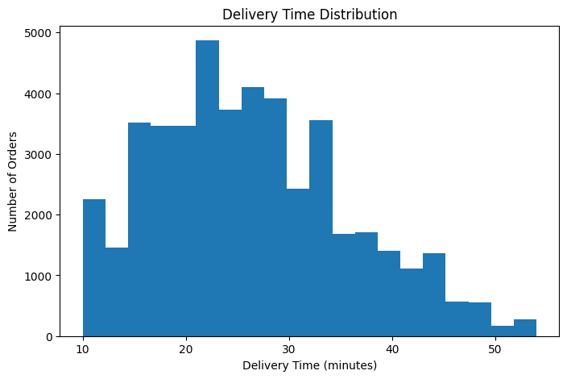
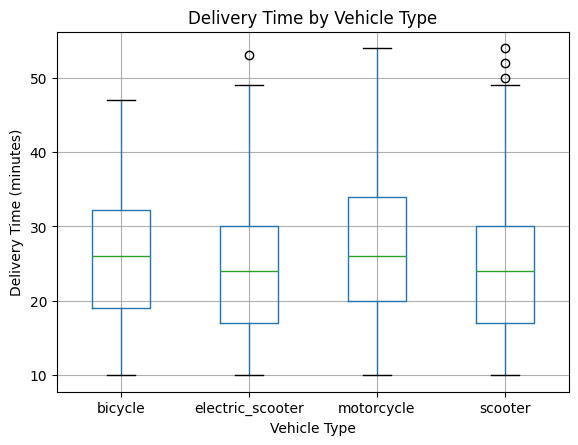
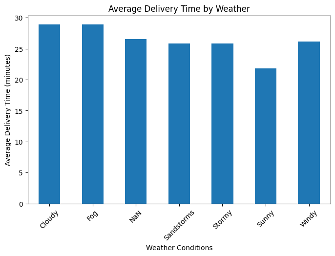
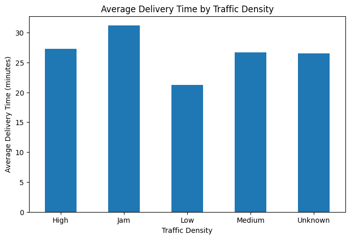
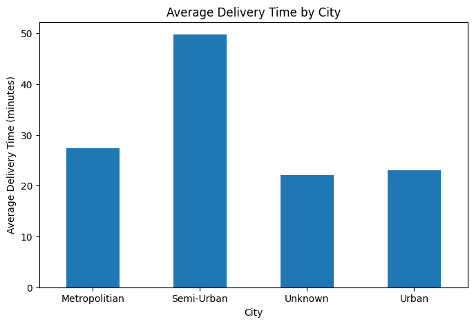
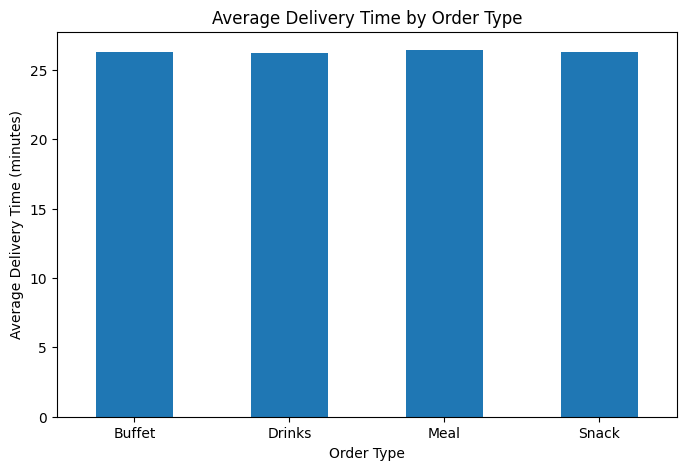
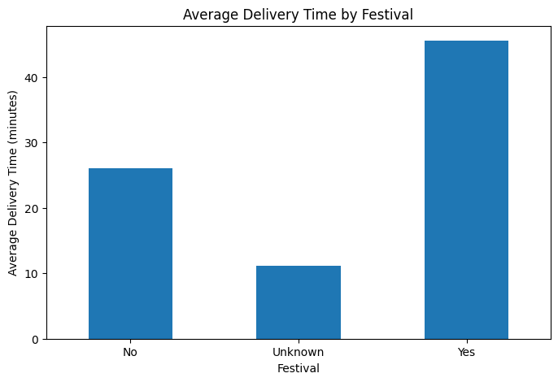
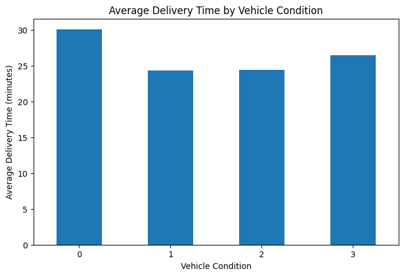
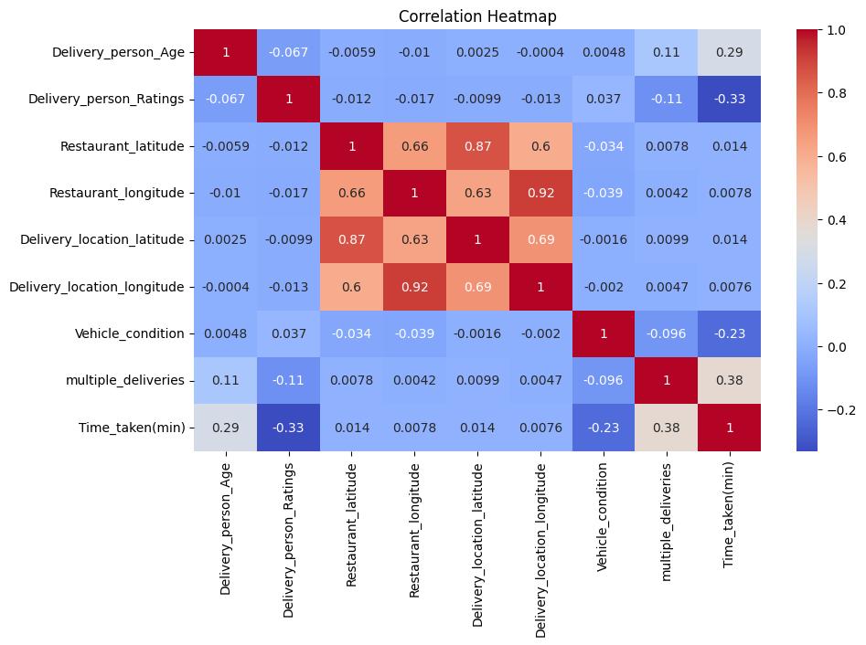

# 🍔 Food Delivery Data Cleaning & Analysis

## 📌 Project Overview

This project focuses on data cleaning, exploratory data analysis (EDA), data visualization, and reporting using a food delivery dataset.

The objective is to transform raw food delivery data into a clean, structured, and analysis-ready dataset by handling missing values, inconsistent data, duplicate records, incorrect formats, and analyzing factors related to delivery time.

## 🎯 Objectives

- Clean and preprocess the raw food delivery dataset
- Identify and handle missing values
- Remove unnecessary spaces and inconsistent text values
- Convert columns into appropriate data types
- Check for duplicate records
- Convert date values into proper datetime format
- Perform exploratory data analysis
- Analyze delivery time across different factors
- Generate meaningful visualizations
- Export the cleaned dataset and summary report

## 🛠️ Technologies Used

- Python
- Pandas
- NumPy
- Matplotlib
- Seaborn
- Google Colab
- Git
- GitHub

# 📊 Dataset Information

The dataset contains information about food delivery orders, delivery partners, restaurants, weather conditions, traffic density, vehicles, and delivery time.

| Metric | Value |
|---|---:|
| Total Records | 45,593 |
| Total Columns | 20 |
| Missing Values After Cleaning | 0 |
| Duplicate Records | 0 |
| Average Delivery Time | 26.29 minutes |
| Average Delivery Person Age | 29.58 years |
| Average Delivery Rating | 4.64 |

## 📋 Important Dataset Columns

| Column | Description |
|---|---|
| `ID` | Unique order identifier |
| `Delivery_person_ID` | Delivery person's identifier |
| `Delivery_person_Age` | Age of delivery person |
| `Delivery_person_Ratings` | Delivery person's rating |
| `Restaurant_latitude` | Restaurant latitude |
| `Restaurant_longitude` | Restaurant longitude |
| `Delivery_location_latitude` | Delivery location latitude |
| `Delivery_location_longitude` | Delivery location longitude |
| `Order_Date` | Date of order |
| `Time_Orderd` | Time when order was placed |
| `Time_Order_picked` | Time when order was picked |
| `Weatherconditions` | Weather during delivery |
| `Road_traffic_density` | Traffic density |
| `Vehicle_condition` | Condition of delivery vehicle |
| `Type_of_order` | Type of food order |
| `Type_of_vehicle` | Vehicle used for delivery |
| `multiple_deliveries` | Number of deliveries handled together |
| `Festival` | Festival status |
| `City` | City category |
| `Time_taken(min)` | Delivery time in minutes |

# 🧹 Data Cleaning Process

## 1. Data Loading

The raw dataset was loaded using Pandas.

```python
import pandas as pd
import numpy as np

train = pd.read_csv("train.csv")
test = pd.read_csv("test.csv")
```

## 2. Removing Extra Spaces

Leading and trailing spaces were removed from text columns.

```python
for col in train.select_dtypes(include="object").columns:
    train[col] = train[col].str.strip()
```

## 3. Handling Missing-Value Strings

Some missing values were stored as text such as `NaN`, `nan`, `NA`, and `N/A`.

These were converted into actual missing values.

```python
train = train.replace(["NaN", "nan", "NA", "N/A"], np.nan)
```

## 4. Cleaning Weather Conditions

Values such as `conditions Sunny` and `conditions Fog` were standardized.

```python
train["Weatherconditions"] = train["Weatherconditions"].str.replace(
    "conditions ", "", regex=False
)
```

Example:

```text
conditions Sunny → Sunny
conditions Fog → Fog
conditions Stormy → Stormy
```

## 5. Numerical Data Conversion

The following columns were converted into numerical format:

- `Delivery_person_Age`
- `Delivery_person_Ratings`
- `multiple_deliveries`
- `Time_taken(min)`

Mixed-format values were cleaned before conversion.

Example:

```text
(min) 24 → 24
```

```python
numeric_cols = [
    "Delivery_person_Age",
    "Delivery_person_Ratings",
    "multiple_deliveries",
    "Time_taken(min)"
]

for col in numeric_cols:
    train[col] = pd.to_numeric(
        train[col].astype(str).str.extract(r"(\d+\.?\d*)")[0],
        errors="coerce"
    )
```

## 6. Missing Value Handling

Missing numerical values were handled using median imputation.

Missing categorical values were replaced with `Unknown`.

```python
numeric_cols = [
    "Delivery_person_Age",
    "Delivery_person_Ratings",
    "multiple_deliveries"
]

for col in numeric_cols:
    train[col] = train[col].fillna(train[col].median())
```

```python
categorical_cols = [
    "Time_Orderd",
    "Road_traffic_density",
    "Festival",
    "City"
]

for col in categorical_cols:
    train[col] = train[col].fillna("Unknown")
```

After cleaning:

**Missing values = 0**

## 7. Duplicate Check

The dataset was checked for duplicate records.

```python
train.duplicated().sum()
```

Result:

**0 duplicate records**

## 8. Date Conversion

The `Order_Date` column was converted into proper datetime format.

```python
train["Order_Date"] = pd.to_datetime(
    train["Order_Date"],
    dayfirst=True,
    errors="coerce"
)
```

Resulting data type:

`datetime64[ns]`

# 📈 Exploratory Data Analysis

## 1. Delivery Time Distribution



## 2. Delivery Time by Vehicle Type



## 3. Average Delivery Time by Weather



## 4. Average Delivery Time by Traffic Density



## 5. Average Delivery Time by City



## 6. Average Delivery Time by Order Type



## 7. Average Delivery Time by Festival



## 8. Average Delivery Time by Vehicle Condition



## 9. Correlation Heatmap



# 🔍 Key Findings

- The dataset contains 45,593 delivery records.
- The average delivery time is approximately 26.29 minutes.
- The average delivery person age is approximately 29.58 years.
- The average delivery rating is approximately 4.64.
- Missing values were successfully handled.
- No duplicate records were found after cleaning.
- Delivery time was analyzed across weather conditions, traffic density, city, order type, festival status, vehicle type, and vehicle condition.
- Numerical relationships were explored using a correlation heatmap.

# 💾 Output Files

### Cleaned Dataset

`cleaned_food_delivery_data.csv`

Contains the cleaned and processed food delivery dataset.

### Jupyter Notebook

`Data_Cleaning.ipynb`

Contains the complete Python workflow used for data cleaning and analysis.

### Summary Report

`data_summary_report.csv`

Contains descriptive statistics generated from the cleaned dataset.

### Visualizations

The `visualizations` folder contains all generated charts.

# 📁 Project Structure

```text
food-delivery-data-analysis/
│
├── README.md
├── Data_Cleaning.ipynb
├── cleaned_food_delivery_data.csv
├── data_summary_report.csv
│
└── visualizations/
    ├── delivery_time_distribution.png
    ├── delivery_time_by_vehicle.png
    ├── delivery_time_by_weather.png
    ├── delivery_time_by_traffic.png
    ├── delivery_time_by_city.png
    ├── delivery_time_by_order_type.png
    ├── delivery_time_by_festival.png
    ├── delivery_time_by_vehicle_condition.png
    └── correlation_heatmap.png
```

# 🚀 How to Run

## 1. Clone the Repository

```bash
git clone https://github.com/Kanchan1903/food-delivery-data-analysis.git
```

## 2. Open the Project Folder

```bash
cd food-delivery-data-analysis
```

## 3. Open the Notebook

Open:

`Data_Cleaning.ipynb`

## 4. Run the Notebook

Run the cells sequentially in Google Colab or Jupyter Notebook.

# ✅ Final Result

The raw food delivery dataset was successfully cleaned, processed, analyzed, and visualized using Python.

This project demonstrates practical skills in:

- Data Cleaning
- Data Preprocessing
- Exploratory Data Analysis
- Data Visualization
- Python Programming
- Pandas
- NumPy
- Matplotlib
- Seaborn
- Reporting
- Git & GitHub

# 👩‍💻 Author

**Kanchan Deshmukh**

B.Tech Computer Engineering
